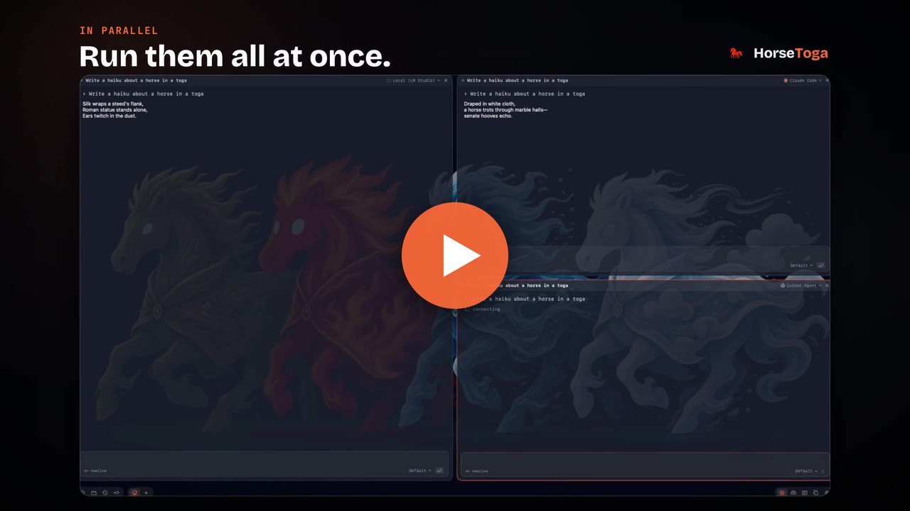

# HorseToga

An Omarchy-inspired workspace for LLMs on macOS: a keyboard-first tiling workspace where multiple AI agents run side by side, summoned from a global launcher panel, themed end to end.

[](https://jchan7.github.io/horsetoga/#demo)

▶ [Watch the one-minute demo](https://jchan7.github.io/horsetoga/#demo)

- Bring your own AI, any CLI agent: Claude Code, Codex, Gemini CLI, OpenCode, Cursor Agent, Mistral Vibe, Kimi Code, Grok CLI out of the box — each is a config entry, and `~/Library/Application Support/com.jasonchan.horsetoga/providers.json` adds or overrides any CLI without a rebuild (see `providers.example.json` beside it). API keys (Anthropic, OpenAI, xAI) live in the Providers dock app too; switch provider/model per session from the tile header
- Tiling screens: Hyprland-style dwindle splits; Home plus up to nine live screens that auto-persist and restore at launch, all keyboard
- View modes: the same live sessions re-project as tiles, an inbox, a Linear-style tracker, or a rookery of penguins — switch per workspace with ⌘⇧V or the bottom-bar switcher
- Built-in apps live in a macOS-style dock (usage, files, editor, mail, slides, sheets) and open as their own full-window section (⌘U for usage, ⎋ closes); each app exposes state + tools to the AI
- Themes are folders of JSON + assets, hot-reloaded, switched live with ⌘T (the switcher also opens on first launch so you pick one); "Import image…" in the switcher turns any picture into a new theme (bundled: Horses, Drift, Modern, Alta, Tokyo, Marble, Lake)

## Requirements

- macOS 26+, Xcode 26+
- [XcodeGen](https://github.com/yonaskolb/XcodeGen): `brew install xcodegen`
- For CLI providers: `claude` and/or `codex` installed and logged in

## Build

```bash
cd horsetoga
xcodegen generate
xcodebuild -project HorseToga.xcodeproj -scheme HorseToga -configuration Debug build
open ~/Library/Developer/Xcode/DerivedData/HorseToga-*/Build/Products/Debug/HorseToga.app
```

Or open `HorseToga.xcodeproj` in Xcode and hit run. Regenerate the project with `xcodegen generate` whenever files are added or removed (the .xcodeproj is gitignored).

Tests: `xcodebuild -project HorseToga.xcodeproj -scheme HorseToga -destination 'platform=macOS' test`

## Keys

- `⌥Space` summon launcher panel (from anywhere)
- Panel: `↩` send · `⇧↩` newline · `⌘↩` expand into workspace · `⎋` cancel/clear/dismiss
- Workspace: `⌘K` command palette (search every command) · `⌘↩` new session tile · `⌘⇧↩` history picker (pull any past chat into the workspace) · `⌘0` Home · `⌘S` on Home saves its chats as the next numbered screen · `⌘1-9` screens · `⌘N` new screen · `⌘[`/`⌘]` previous/next screen (wraps) · `⌘⇧W` close screen (right-click a tile works too) · `⌘D`/`⌘⇧D` split right/down · `⌘⌥←↑↓→` focus · `⌃⌘←↑↓→` swap · `⌃⌥←↑↓→` resize · `⌘⇧F` zoom · `⌘W` close tile · `⌘T` themes · `⌘U` usage · `⌘Y` history (every past chat, searchable, reopen into a tile) · `⌘⇧C` cycle dock apps (usage / files / history / providers) · `⌘⇧V` cycle view mode (tiles / inbox / tracker / rookery — also clickable in the bottom bar)

## Layout

- `HorseToga/Panel` launcher panel (non-activating NSPanel)
- `HorseToga/Workspace` tiling engine (binary split tree) + tile views
- `HorseToga/Providers` ChatProvider protocol; subprocess adapter (claude/codex) + HTTP adapters
- `HorseToga/Conversation` runners + view models (streams outlive views); ConversationArchive persists every chat to disk
- `HorseToga/Apps` app modules (usage dashboard; AI-visibility contract)
- `HorseToga/Theme` manifest → resolver → environment; FSEvents hot reload
- `HorseToga/Hotkey` Carbon global hotkeys + key combos
- User data: `~/Library/Application Support/com.jasonchan.horsetoga/` (themes live in `Themes/`, chat history in `Conversations/`, screens in `screens.json`)

## Release

Direct distribution (Developer ID + notarization and Sparkle updates) — not the App Store, because HorseToga spawns the `claude`/`codex` CLIs and reads keychain items, which the sandbox forbids.

One-time setup:

1. Apple Developer Program → in Xcode ▸ Settings ▸ Accounts create a **Developer ID Application** certificate; `export HORSETOGA_TEAM_ID=<your 10-char team id>`.
2. `xcrun notarytool store-credentials horsetoga-notary --apple-id <id> --team-id $HORSETOGA_TEAM_ID --password <app-specific password>`
3. `brew install xcodegen gh && gh auth login`. Releases publish to this repo's GitHub Releases: each release carries the DMG and `appcast.xml`, and Sparkle reads the feed from `releases/latest/download/appcast.xml`.
4. Sparkle signing key: build once so SPM resolves Sparkle, then run `generate_keys` from `~/Library/Developer/Xcode/DerivedData/HorseToga-*/SourcePackages/artifacts/sparkle/Sparkle/bin/`. The private key stays in your login keychain (never in the repo); paste the printed public key into `SUPublicEDKey` in `HorseToga/Resources/Info.plist`.
5. Replace the placeholder icon: `scripts/make-icon.sh path/to/icon-1024.png`.

`scripts/bootstrap.sh` reports what's still missing. Then:

```bash
HORSETOGA_TEAM_ID=XXXXXXXXXX scripts/release.sh 0.2.0
```

builds a Release archive, exports and verifies the Developer ID signature, packages `release/HorseToga-0.2.0.dmg`, notarizes and staples it, regenerates `appcast.xml`, publishes the DMG and `appcast.xml` as assets of a GitHub release on this repo, and tags `v0.2.0`. Without `HORSETOGA_TEAM_ID` the individual steps (`scripts/build-release.sh`, `scripts/make-dmg.sh`) still run and produce an ad-hoc signed build for local testing.

## License

MIT. Copyright © 2026 Jason Chan. See [LICENSE](LICENSE).
